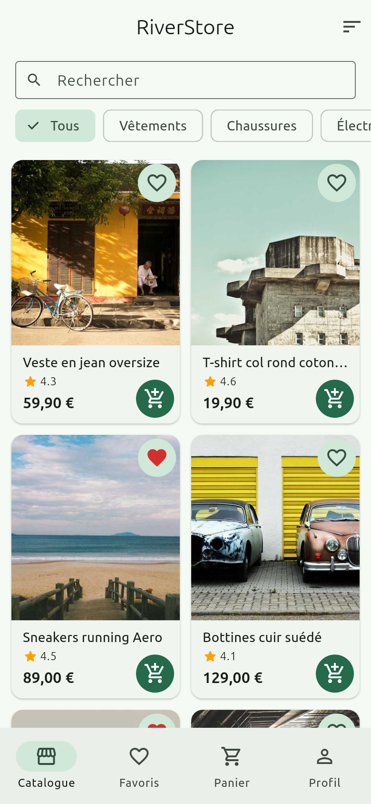
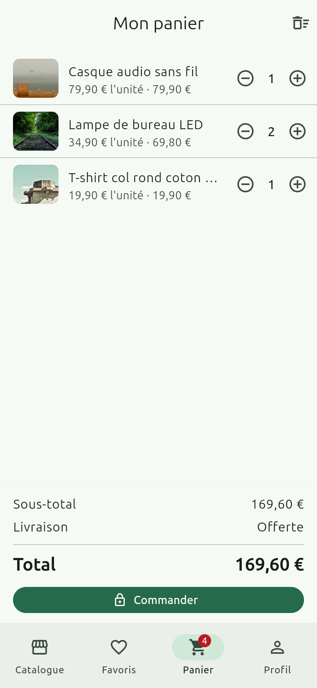
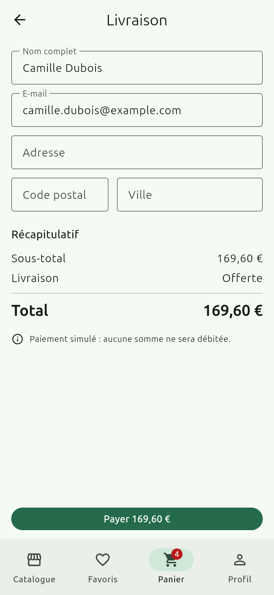
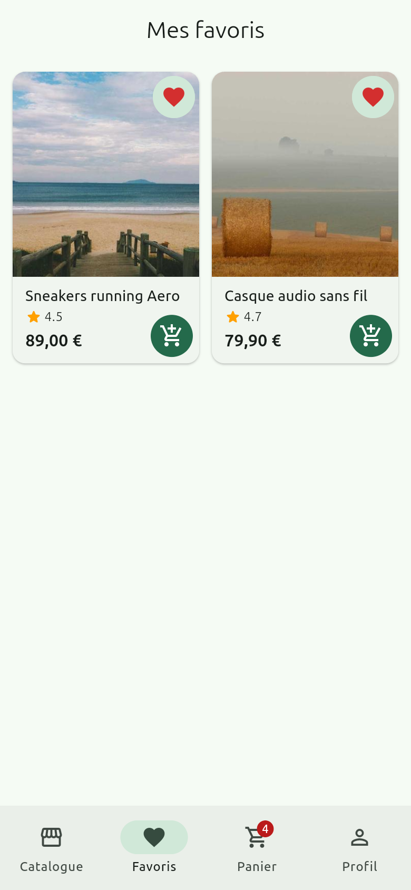
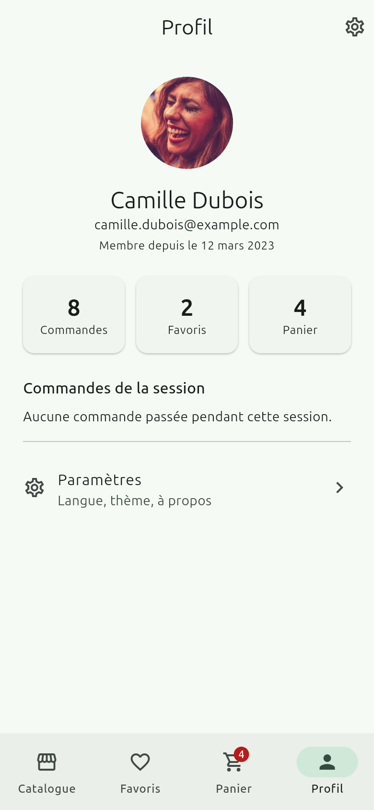
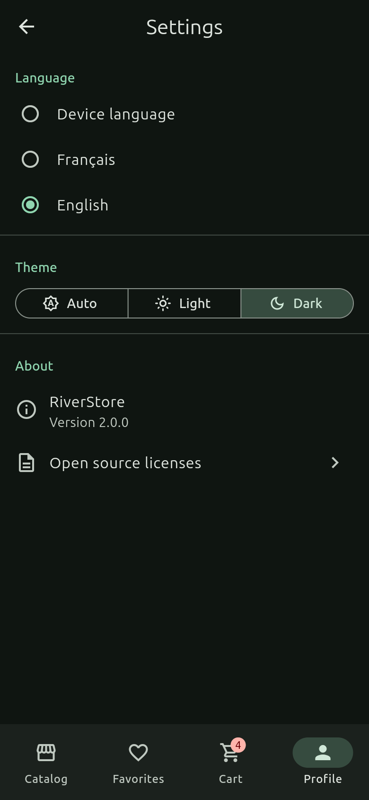
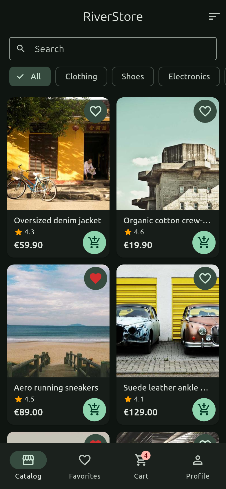

# RiverStore

[](https://github.com/dp1370913-pixel/riverstore/actions/workflows/ci.yml)


[](LICENSE)

Application e-commerce Flutter, développée au départ pour le jalon
« State management avec Riverpod » puis rendue **production-ready** :
architecture en couches, 8 écrans, internationalisation FR/EN,
accessibilité vérifiée par des tests, performances mesurées, CI/CD et APK
publié automatiquement.

> **APK de démonstration** : téléchargeable dans les
> [Releases](https://github.com/dp1370913-pixel/riverstore/releases) (publié
> par la CI à chaque tag `v*`) ou dans les artefacts du dernier run CI.

## Sommaire

- [Captures d'écran](#captures-décran)
- [Fonctionnalités](#fonctionnalités)
- [Architecture](#architecture)
- [Performance](#performance)
- [Accessibilité](#accessibilité)
- [Internationalisation](#internationalisation)
- [Tests](#tests)
- [CI/CD](#cicd)
- [Installation](#installation)
- [Limites connues](#limites-connues)

## Captures d'écran

| Catalogue | Détail | Panier | Livraison |
|:---:|:---:|:---:|:---:|
|  |  |  |  |

| Favoris | Profil | Paramètres (EN, sombre) | Catalogue (EN, sombre) |
|:---:|:---:|:---:|:---:|
|  |  |  |  |

Les captures sont générées par un test (`integration_test/screenshots_test.dart`),
ce qui les garde à jour avec le code (voir [Installation](#installation)).

## Fonctionnalités

| Écran | Contenu |
|---|---|
| **Catalogue** | Grille responsive paresseuse, recherche (debounce, insensible aux accents, FR + EN), filtres par catégorie, tri, pull-to-refresh, états chargement / vide / erreur |
| **Détail produit** | Image pleine taille, note, catégorie, stock, ajout au panier plafonné au stock |
| **Favoris** | Produits favoris persistés entre les sessions |
| **Panier** | Quantités, suppression par glissement avec « Annuler », vidage confirmé, livraison offerte dès 50 € |
| **Livraison** | Formulaire validé (e-mail, code postal), pré-rempli depuis le profil, autofill, paiement simulé |
| **Confirmation** | Numéro de commande, adresse, récapitulatif |
| **Profil** | Statistiques (commandes, favoris, panier), commandes de la session |
| **Paramètres** | Langue (appareil / FR / EN) et thème (auto / clair / sombre), persistés ; licences |

Sur grand écran (≥ 840 dp), la barre de navigation du bas est remplacée par
un rail latéral.

## Architecture

```
lib/
├── main.dart                  # Point d'entrée : SharedPreferences puis buildApp()
├── l10n/                      # ARB FR/EN + classes générées (gen-l10n)
└── src/
    ├── bootstrap.dart         # ProviderScope + injection des dépendances
    ├── app.dart               # MaterialApp.router (locale, thème, routeur)
    ├── core/                  # Pur Dart : formatage, validation, recherche
    ├── data/
    │   ├── models/            # Modèles immuables (Product, CartState, Order…)
    │   └── repositories/      # Interfaces + implémentations (assets, mocks, prefs)
    ├── providers/             # Logique métier Riverpod (aucun widget)
    ├── router/                # go_router : routes typées, StatefulShellRoute
    └── ui/
        ├── screens/           # 8 écrans
        ├── shell/             # Barre de navigation / rail adaptatif
        ├── widgets/           # Composants réutilisables
        └── theme/
```

**Flux de données** : `Repository` → `Provider` / `Notifier` → providers
dérivés (`select`, `family`) → widgets. Les widgets ne contiennent pas de
logique métier ; tout ce qui peut l'être est une fonction pure testée
isolément (`applyFilterAndSort`, `OrderPricing`, `Validators`,
`formatPrice`, `normalizeForSearch`).

### Choix techniques

| Sujet | Choix | Raison |
|---|---|---|
| État | Riverpod 3 (`Notifier`, `AsyncNotifier`) | Injection testable (`overrideWithValue`), providers dérivés, pas de code généré |
| Widgets à état local | `flutter_hooks` (`HookConsumerWidget`) | Contrôleurs, animations et debounce libérés automatiquement, sans `StatefulWidget` |
| Navigation | go_router + `StatefulShellRoute` | Chaque onglet conserve sa pile, routes testables, page 404 |
| Montants | `int` en centimes | Aucune erreur d'arrondi dans les totaux |
| Persistance | `shared_preferences` | Favoris et réglages ; lecture tolérante aux valeurs corrompues |
| i18n | `flutter_localizations` + `intl` (gen-l10n) | Pluriels ICU, dates et devises localisées |
| Données | JSON embarqué + repositories mockés | Démo hors-ligne et tests déterministes ; remplaçable par une API sans toucher l'UI |

## Performance

Mesures faites avec `integration_test/performance_test.dart` en **mode
profile** (`flutter drive --profile`) : 6 flings sur le catalogue,
112 frames.

| Métrique (thread UI) | Valeur | Budget 60 fps |
|---|---|---|
| Temps de build moyen | **1,2 ms** | 16,7 ms |
| 90ᵉ percentile | 2,2 ms | 16,7 ms |
| Pire frame | 10,2 ms | 16,7 ms |
| Frames hors budget (build) | **0** | — |

Ce qui garantit ces chiffres :

- **Pas de rebuild inutile** : badge du panier, lignes du panier et boutons
  favoris écoutent chacun uniquement leur valeur (`select`, `family`). Un
  test vérifie qu'un changement de quantité ne notifie pas la liste du
  panier (`cart_notifier_test.dart`). Constructeurs `const` partout (lint
  `prefer_const_constructors`).
- **Images optimisées** : miniatures 400 px dans les grilles et 800 px dans
  le détail, décodage à la taille réellement affichée (`cacheWidth`, arrondi
  par paliers de 100 px pour partager le cache), avatar via `ResizeImage`,
  fond réservé et fondu (aucun saut de mise en page).
- **Lazy-loading** : `GridView.builder` / `ListView.builder`, si bien que
  seules les cartes visibles (et leurs images) sont construites et
  téléchargées.
- **Travail évité** : recherche debouncée (300 ms), catalogue chargé une
  seule fois puis filtré en mémoire.

> Le temps de **raster** n'est pas significatif sur la machine de mesure
> (Linux, GPU Intel UHD 600 via XWayland) : une application Flutter vide de
> référence y affiche le même ordre de grandeur (~100 ms par frame). Pour
> une mesure GPU représentative, lancer le test de performance sur un
> appareil Android physique (commande dans [Tests](#tests)).

## Accessibilité

- Tous les boutons-icônes ont un **tooltip localisé** (lu par TalkBack et
  VoiceOver) : favoris, ajout au panier avec le nom du produit, quantité +/−,
  tri, vider le panier, paramètres.
- La carte produit est annoncée comme **un seul bouton descriptif**
  (« Casque audio, 79,90 €, noté 4.7 sur 5 ») ; ses boutons favori et panier
  restent des nœuds séparés.
- Quantité annoncée en **région live**, état activé/désactivé sur le
  bouton favori, **action d'accessibilité** « Retirer du panier » (alternative au
  glissement), en-têtes sémantiques, images décoratives exclues et photos
  produit décrites.
- `test/widget/accessibility_test.dart` vérifie sur **les 7 écrans
  principaux** les recommandations Flutter : zones tactiles ≥ 48 dp
  (Android) / 44 pt (iOS), éléments interactifs étiquetés, contraste du
  texte.

## Internationalisation

- Français et anglais via `lib/l10n/app_fr.arb` (modèle) et `app_en.arb`
  (112 clés, pluriels ICU, dates `yMMMMd`).
- Les données produits sont bilingues (`{"fr": …, "en": …}`), avec repli
  sur le français.
- Prix formatés selon la langue : `1 234,56 €` / `€1,234.56`.
- Par défaut l'app suit la langue de l'appareil (une langue non supportée
  bascule en anglais), et l'utilisateur peut la forcer dans Paramètres.
- Un test vérifie que les deux fichiers ARB définissent exactement les
  mêmes clés, et un autre que chaque produit du catalogue est traduit.

## Tests

| Type | Nombre | Emplacement | Couvre |
|---|---|---|---|
| Unitaires | 45 | `test/unit/` | Panier, favoris, filtres/tri, réglages, checkout (mocktail), repositories, modèles, validation, formatage, intégrité des données et des traductions |
| Widgets | 29 | `test/widget/` | Carte produit, stepper, catalogue (chargement, debounce, filtres, erreur/réessai), panier, checkout, app complète (langue, badge, commande, 404), accessibilité × 7 écrans |
| Intégration | 3 | `integration_test/` | Parcours d'achat complet, persistance après redémarrage, performance du défilement |

Couverture de lignes : **84 %**.

```bash
flutter test                         # unitaires + widgets
flutter test --coverage              # + coverage/lcov.info

# Intégration (un fichier à la fois : l'app Linux est mono-instance)
flutter test integration_test/purchase_flow_test.dart -d linux
flutter test integration_test/preferences_flow_test.dart -d linux
flutter test integration_test/performance_test.dart -d <android-device-id>

# Mesure de performance en mode profile
flutter drive --profile --driver=test_driver/integration_test.dart \
  --target=integration_test/performance_test.dart -d <device>
```

## CI/CD

`.github/workflows/ci.yml`, déclenché sur push, pull request et tag :

1. **Lint & tests** : `dart format` (échec si non formaté),
   `flutter analyze --fatal-infos --fatal-warnings`, `flutter test --coverage`
   (taux affiché dans le résumé du run).
2. **Tests d'intégration** : application Linux desktop sous Xvfb.
3. **Build Android** : APK release en artefact ; sur un tag `v*`, création
   d'une release GitHub avec l'APK attaché.

Dependabot surveille les dépendances pub et les actions GitHub.

## Installation

Prérequis : Flutter **3.47** (Dart 3.13). Pour Android : un JDK 17+ complet
(avec `javac`).

```bash
git clone https://github.com/dp1370913-pixel/riverstore.git
cd riverstore
flutter pub get          # génère aussi les traductions
flutter run              # appareil ou émulateur connecté
flutter build apk --release
```

Régénérer les captures d'écran :

```bash
flutter test integration_test/screenshots_test.dart -d linux \
  --dart-define=SCREENSHOT_DIR=$PWD/docs/screenshots
```

## Limites connues

- Backend simulé : catalogue en JSON local, profil et commandes mockés
  (paiement fictif). Les interfaces `ProductRepository`, `UserRepository`
  et `OrderRepository` permettent de brancher une vraie API.
- Le panier et l'historique des commandes ne sont pas persistés entre les
  sessions (seuls les favoris et les réglages le sont).
- L'APK est signé avec la clé de debug : suffisant pour une démonstration,
  pas pour une publication sur le Play Store.
- Images de démonstration fournies par picsum.photos (connexion requise ;
  un pictogramme les remplace hors-ligne).
- Sous Linux avec un GNOME récent, lancer l'app avec `GDK_BACKEND=x11` pour
  contourner un bug GTK 3 (« Settings schema … does not contain a key named
  'antialiasing' »).

## Licence

[MIT](LICENSE)
